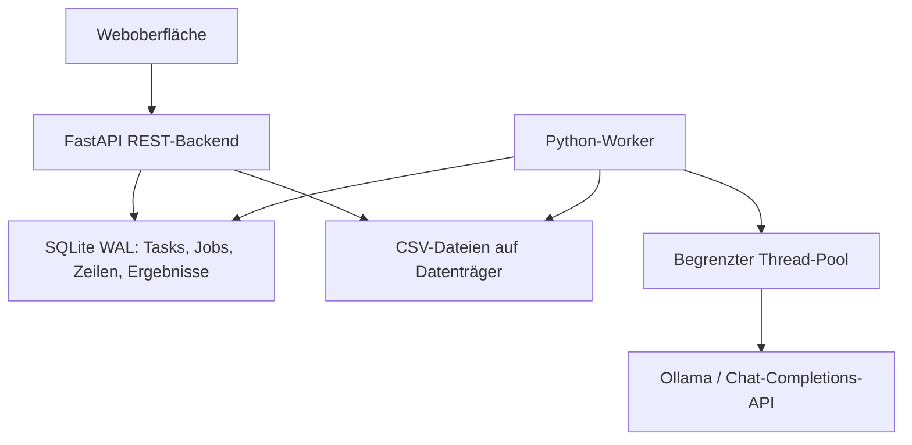

# TextLab 0.2.0 — LLM-basierte Textklassifikation und Evaluation

Eine lokal betreibbare Python-Anwendung mit REST-Backend, separatem Job-Worker und deutscher Weboberfläche. Für wiederholbare computergestützte Inhaltsanalysen mit Ollama, vLLM oder anderen OpenAI-kompatiblen Chat-APIs.

## Neu in 0.2.0

Gold-Datensätze mit Spaltenmapping, Evaluationen über mehrere Modell-/Parameterkonfigurationen, Standardmetriken, Klassenvergleiche, Confusion-Matrizen und HTML-/CSV-/JSON-/SVG-/PNG-/ZIP-Reports. Begründungen und wortgetreue Textbelege sind unabhängig je Task oder Job konfigurierbar; vom Server ausgegebener Thinking-Text wird mitgespeichert.

**Bedienung, Metrikdefinitionen, API und Upgrade-Anleitung:** [EVALUATION.md](EVALUATION.md). **Upgrade:** beide alten Prozesse stoppen, Quellcode im bisherigen Projektverzeichnis ersetzen und dasselbe Datenvolume weiterverwenden. Die Datenbank wird additiv migriert.

## Start mit Docker

```bash
cp .env.example .env
docker compose up --build -d
```

Oberfläche: http://localhost:8080 · REST-Dokumentation: http://localhost:8080/docs

```bash
docker compose logs -f worker
docker compose down
```

Das benannte Volume `textlab-data` bewahrt Tasks, Jobs, Uploads und Ergebnisse. `docker compose down -v` würde diese Daten löschen. Die Container benötigen selbst keine GPU: Sie sprechen einen vorhandenen Modellserver über HTTP an. Docker/Compose müssen installiert sein; alternativ direkter Python-Betrieb unten.

Die Compose-Konfiguration bindet nur an 127.0.0.1. Für einen entfernten Server kann ein SSH-Tunnel genutzt werden:

```bash
ssh -L 8080:127.0.0.1:8080 benutzer@server
```

## Start direkt mit Python (Linux / WSL2)

```bash
python3 -m venv .venv
source .venv/bin/activate
pip install -r requirements.lock
pip install --no-deps -e .
export TEXTLAB_DATA="$PWD/data"
python -m uvicorn textlab.api:app --host 127.0.0.1 --port 8080
```

In einem zweiten Terminal, aus demselben Projektverzeichnis:

```bash
source .venv/bin/activate
export TEXTLAB_DATA="$PWD/data"
python -m textlab.worker
```

Beide Prozesse müssen dasselbe Datenverzeichnis und dieselben API-Key-Umgebungsvariablen verwenden. Die `.env`-Datei wird von Docker Compose geladen; beim direkten Python-Start Umgebungsvariablen explizit setzen. Das Prozess-Locking nutzt `fcntl`; unter Windows WSL2 oder Docker verwenden.

## Erster Durchlauf

1. **Task-Bibliothek:** Task anlegen, Gegenstand in den Kodieranweisungen konkret benennen, Kategorien definieren und Beispiele ergänzen. FOR / AGAINST / NO sind ein bearbeitbarer Ausgangspunkt.
2. **LLM-Verbindungen:** Profil für den Modellserver anlegen und mit „Modelle abfragen“ prüfen.
3. **Datensätze:** `examples/texts.csv` oder eigene CSV hochladen; Trennzeichen und Kodierung wählen. Auf „Bereit“ warten.
4. **Jobs:** Task, Datensatz, Textspalte, Profil und Modell auswählen. Parallelität und Query-Parameter konfigurieren.
5. Job öffnen: Fortschritt, Fehler, Tokenzahlen und Ergebnisse ansehen. Pausieren, fortsetzen oder abbrechen. Nach Abschluss CSV, JSONL oder Parquet herunterladen.

Ein Profil vom Typ **Demo** funktioniert ohne LLM. Es vergibt absichtlich immer das erste Label und dient ausschließlich dem Funktionstest, nicht einer inhaltlichen Analyse.

## Verbindungskonfiguration

| Server | API-Typ | Basis-URL bei Docker-Betrieb |
|---|---|---|
| vLLM | OpenAI-kompatibel | `http://host.docker.internal:8000/v1` |
| Ollama | Ollama (native API) | `http://host.docker.internal:11434` |
| Andere Chat-Completions-API | OpenAI-kompatibel | Basis-URL einschließlich des API-Präfixes, häufig `/v1` |

Bei direktem Python-Betrieb auf dem Modellserver kann `localhost` verwendet werden. Unter Linux muss ein Host-Modellserver auf einer vom Docker-Bridge-Netz erreichbaren Adresse lauschen; ein ausschließlich an 127.0.0.1 gebundener Modellserver ist über `host.docker.internal` nicht erreichbar.

Das Profil speichert nur den **Namen** einer Umgebungsvariablen, z. B. `LLM_API_KEY`. Der Wert wird erst beim API-Aufruf aus der Prozessumgebung gelesen und nicht im Job-Snapshot gespeichert. Nach Änderung der `.env`-Datei Container neu erzeugen: `docker compose up -d --force-recreate`.

Modelllisten stammen aus `GET /models` bzw. `GET /api/tags`. Eine Modell-ID lässt sich auch manuell eingeben. Structured Outputs werden über `response_format.json_schema` bzw. Ollamas `format` angefordert. Bei einem Server mit eingeschränkter Schema-Unterstützung kann im Job auf JSON-Objekt oder reine Prompt-Instruktion umgestellt werden; die lokale Ergebnisvalidierung bleibt aktiv.

Offizielle API-Referenzen:
- https://docs.vllm.ai/en/latest/features/structured_outputs/
- https://docs.ollama.com/api/chat

## Task-Modell und Auswertungskonventionen

Ein Task enthält:

- Name, Beschreibung und allgemeine Kodieranweisungen, einschließlich Untersuchungsgegenstand und Kodiereinheit.
- Eindeutige Labels, Definitionen und pro Kategorie eine Liste von Few-Shot-Texten. Diese Beispiele erhalten jeweils genau das zugehörige Label.
- Zusätzliche Few-Shot-Beispiele als `{text, labels, rationale}`; damit sind auch echte Multi-Label-Beispiele möglich.
- `single`: genau ein Label aus mehreren Klassen; `multi`: mehrere Labels, optional eine leere Auswahl.
- Explizite Regel für unklare Fälle. Bei Single-Label eine eigene Restkategorie definieren, falls erforderlich.
- Optional eine kurze Begründung als `rationale` und unabhängig davon wortgetreue Textbelege als `evidence`. Je Job sind diese Task-Vorgaben überschreibbar.

Interner Output ist bewusst ein festes, streng validiertes JSON-Schema:

```json
{"labels": ["FOR"], "rationale": "Der Text befürwortet die Maßnahme ausdrücklich."}
```

Ohne Begründungsoption darf das Feld `rationale` nicht ausgegeben werden. Unbekannte Labels, Duplikate, falsche Anzahl, zusätzliche Felder, Markdown-Codeblöcke und syntaktisch ungültiges JSON werden zurückgewiesen. Frei definierbare zusätzliche Output-Felder sind in v0.2 nicht vorgesehen. Downloadformate sind vom LLM-Output unabhängig.

Für wissenschaftliche Tasks zusätzlich sinnvoll: Inklusions-/Exklusionskriterien, Prioritätsregeln bei widersprüchlichen Aussagen, Bezug auf Sprecher oder zitierten Akteur, Sprache und zeitlicher Kontext. Diese Regeln gehören in die Kodieranweisungen und Definitionen. Eine numerische Selbstkonfidenz des LLM wird nicht als kalibrierte Unsicherheit vorausgesetzt.

Tasks sind editierbar und gegen versehentliches Überschreiben einer neueren Revision geschützt. Jeder Job speichert ein unveränderliches Snapshot seines Tasks, der Task-Revision, des Profils und aller Query-Parameter. Task-JSON und Job-Snapshot lassen sich herunterladen. Task-JSON kann über `POST /api/tasks` wieder eingelesen werden; für JSON-Import gibt es in v0.2 keinen separaten UI-Button.

## Architektur und Persistenz



- Backend und Worker sind getrennte Prozesse/Container; das Frontend ist eine unabhängige HTML/CSS/JavaScript-Oberfläche, ausgeliefert vom Backend. Die Anwendungslogik ist Python. Ein separater Node-Build ist nicht erforderlich.
- Genau ein Worker-Koordinator pro Datenverzeichnis; ein exklusives Prozess-Lock verhindert versehentliche Doppelstarts. Jobs laufen FIFO, pro Job mit 1–128 parallelen HTTP-Anfragen. Mehrere Jobs werden gespeichert, aber nicht gleichzeitig gerechnet.
- CSV-Upload als gestreamter Request-Body direkt auf Datenträger. Standardlimit 1 GiB, konfigurierbar über `TEXTLAB_MAX_UPLOAD_BYTES`. Uploads sind nicht resumierbar; abgebrochene Verbindungen erfordern erneuten Upload.
- Import mit `csv.DictReader`, Batches von 500 Zeilen. CSV muss eindeutige, nichtleere Spaltennamen, eine konsistente Spaltenzahl und höchstens 10 MiB je CSV-Feld haben. UTF-8/BOM, UTF-8, CP1252 und Latin-1 sind auswählbar. Mehrzeilige korrekt quotierte Felder werden unterstützt. Import läuft im Worker und hat gegenüber weiteren Klassifikationsbatches Vorrang.
- Worker hält nur ein Fenster bis zur gewählten Parallelität im Speicher. Ergebnis und Jobzähler werden atomar gespeichert. Nach einem Absturz überspringt der Worker bereits gespeicherte Zeilen innerhalb des noch nicht abgeschlossenen Fensters.
- Ein API-Aufruf, der vor einem Absturz erfolgreich war, dessen Ergebnis aber noch nicht gespeichert wurde, kann erneut ausgeführt werden: **At-least-once für API-Aufrufe, maximal eine gespeicherte Ergebniszeile je Job und Eingabezeile**. Externe API-Kosten können dabei doppelt anfallen.
- Pausieren/Abbrechen stoppt neue Einreichungen. Laufende Anfragen einschließlich Retries laufen aus; Status bleibt solange „Wird pausiert“ bzw. „Wird abgebrochen“. Fortsetzen ist erst im Status „Pausiert“ möglich. Ein hartes Stoppen des Modellservers wird nicht versucht.
- Ein abgebrochener CSV-Import startet nach Worker-Neustart von vorne. Ein syntaktisch fehlerhafter Import erhält Status „Fehler“ und kann nicht für einen Job verwendet werden.
- Heartbeat zeigt die Erreichbarkeit des Workers. Fortschritts-/Tokenzähler sind inkrementell; ihre Anzeige scannt nicht sämtliche Ergebnisse.

## Fehler, Parameter und Exporte

`retries=2` bedeutet maximal **drei Versuche** je Text. Ungültiger Output, Transportfehler, HTTP 408/429 und 5xx führen zu Wiederholungen mit exponentieller Wartezeit (maximal 30 s je Wartephase). Andere 4xx werden ohne Wiederholung als Fehler gespeichert. Es gibt in v0.2 keinen globalen Circuit Breaker oder serverübergreifenden Rate Limiter; bei anhaltenden Endpunktfehlern Job pausieren/abbrechen.

Leere Texte oder überlange Texte werden ohne API-Aufruf als Fehler markiert. Abschneiden überlanger Texte ist eine ausdrücklich auswählbare Joboption; standardmäßig wird nicht abgeschnitten. Das Original bleibt im Datensatz erhalten. `max_text_chars` ist keine Tokenbudgetberechnung: Kodierbuch, Beispiele und Output müssen zusätzlich in das Kontextfenster passen.

Unterstützt werden Modell-ID, Temperatur, Top-p, Seed, maximale Output-Tokens, Ausgabeformat, Parallelität, Retries, Beispiele je Kategorie, maximale Textlänge und zusätzliche API-Felder über `extra_body`. Einige Parameter hängen vom Modellserver ab. Die Anzahl zusätzlicher globaler Few-Shot-Beispiele wird nicht durch „Beispiele je Kategorie“ begrenzt. Identische Seeds garantieren nicht unter allen Backends bitgenau gleiche Ergebnisse.

Exporte sind für abgeschlossene oder vollständig abgebrochene Jobs verfügbar. So bleiben sie während des Downloads konsistent. Bei Abbruch enthält der Export nur bereits gespeicherte Ergebnisse. Fehlerhafte Zeilen sind enthalten; nie gestartete Zeilen nicht.

- **CSV:** UTF-8 mit BOM; Originalspalten erhalten Präfix `source.`, Ergebnisfelder `classification.`. Labels sind JSON-Listen in einer Zelle. Potenziell als Tabellenformeln interpretierbare Strings erhalten ein vorangestelltes Apostroph; unveränderte Rohstrings gibt es in JSONL/Parquet.
- **JSONL:** pro Zeile Ergebnis-Metadaten plus Originalspalten im Objekt `source`. Labels als echte Listen.
- **Parquet:** blockweise erzeugt, Zstandard-Kompression, flache Spalten analog CSV; Labels als JSON-String. Temporäre Datei wird nach Auslieferung gelöscht.

Export enthält interne stabile `row_no` (1-basierter CSV-Datensatzindex, nicht physische Dateizeile), Labels, Begründung, Status, Fehler, letzte rohe Modellantwort, Versuche, Dauer und gemeldete Tokenzahlen. Zusätzlich werden Textbelege mit Zeichenpositionen, Thinking und die Ausgaben aller Versuche exportiert. Antworttexte werden in v0.2 nicht still gekürzt. Tokenzahlen umfassen alle Antworten eines Textes, soweit der Server sie meldet. Fehlende Tokenangaben erscheinen als 0. Die Ø-Dauer schließt Retry-Wartezeiten ein und ist keine Gesamtdurchsatzmessung.

## Große Datensätze und Betriebsgrenzen

Der Import- und Exportpfad verarbeitet Daten blockweise. Dateigröße und Datensatzanzahl bestimmen den Speicherplatzbedarf, nicht proportional den Python-RAM. Originaldatei, SQLite-Zeilen, Modelloutputs, WAL und gegebenenfalls Parquet-Datei benötigen zusammen mehr Platz als die Eingabe. Insbesondere lange Begründungen können den Ergebnisbestand deutlich vergrößern. Mehrere GiB freien Platz für einen 500-MB-Datensatz vorsehen und den tatsächlichen Ergebnisumfang beobachten.

SQLite/WAL ist für diesen Einzelserver-Koordinator gedacht; Datenverzeichnis auf lokalem Datenträger, nicht NFS. Horizontale Worker-Skalierung, mehrere koordinierte Server, Benutzer-/Rollenverwaltung, SSO und Quoten sind nicht implementiert. Dafür wären als nächste Architekturänderung PostgreSQL, eine explizite Lease-Queue und Authentifizierung sinnvoll. Die Anwendung ist für einen vertrauenswürdigen lokalen/SSH-Zugang vorgesehen; vor einem gemeinsam zugänglichen Betrieb eine Authentifizierung davor schalten.

Persistierte Tasks/Profile/Jobs sind klein; Ergebnislisten nutzen Keyset-Pagination mit maximal 200 Zeilen pro Aufruf. Die Jobübersicht zeigt die letzten 500 Jobs. Es gibt noch keine UI für Datenlöschung, Archivierung, Retries ausschließlich fehlgeschlagener Zeilen, oder mehrere Kodiereinheiten. Gold-Standard-Evaluationen sind im separaten Evaluationsbereich verfügbar.

Eine Million Texte entsprechen einer Million separaten LLM-Anfragen, gegebenenfalls mehr durch Retries. Mehr Threads erhöhen nur die Anzahl gleichzeitiger Requests; GPU-Durchsatz, Kontextlänge und Server-Batching begrenzen die tatsächliche Geschwindigkeit. Für die Inhaltsvalidität separat annotierte Testdaten, Klassenverteilung und Fehlermuster prüfen.

Backups bei gestoppten Containern als vollständige Kopie des Volumes erstellen oder die SQLite-Backup-API verwenden. Eine isolierte Kopie nur der Hauptdatenbank während aktiver WAL-Schreibvorgänge ist kein vollständiges Backup.

## Tests

```bash
pip install -e '.[test]'
python -m pytest -q
PYTHONPATH=. python tests/benchmark_import.py
```

`VALIDATION.md` dokumentiert die tatsächlich durchgeführten Prüfungen und ihre Grenzen. Der Benchmark erzeugt temporär ca. 500 MB CSV sowie die zugehörige Datenbank; ausreichend freien Speicher vorhalten.
